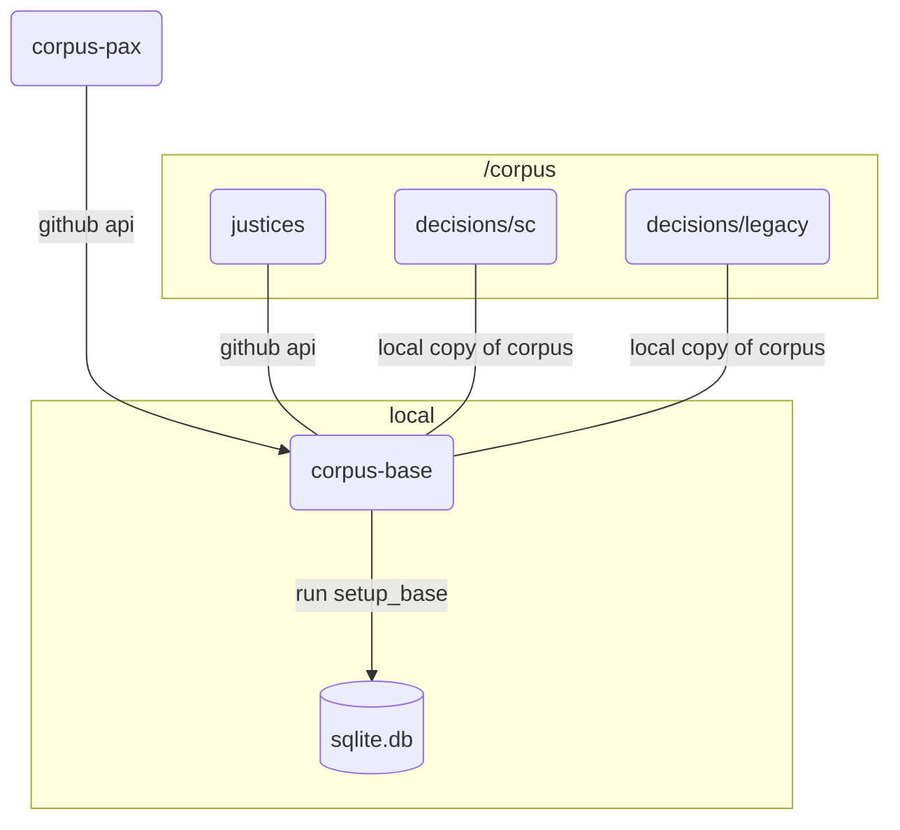

# Corpus-Base

## Overview



## Concept

In tandem with [corpus-pax](https://github.com/justmars/corpus-pax), `corpus-base` creates [sqlpyd](https://github.com/justmars/sqlpyd) tables related to decisions of the Philippine Supreme Court, thereby adding the following:

1. Justices
2. Decisions
   - Citations
   - Votelines
   - Titletags
   - Opinions
   - Segments

## Run

```python shell
>>> from corpus_pax import setup_pax
>>> from corpus_base import setup_base
>>> db_name = 'test.db' # assume target db to be created/recreated is in the present working directory
>>> setup_pax(db_name)
>>> setup_base(db_name) # with segments, takes 1.5 hours
```

## Caveats

### Flow

1. Unlike `corpus-pax` which operates over API calls, `corpus-base` operates locally.
2. It implies parsing through a locally downloaded repository `corpus` to populate tables.
3. _Opinions_ are limited. Save for 1 or 2 sample situations, the present `corpus` only includes the Ponencia.
4. Note that with _Segments_ (fts-enabled relevant text fragments of each _Opinion_) the database size hits ~4.4gb.
5. Segments exclude footnotes.

### Data

The path location of the downloaded `corpus` repository is [hard-coded](./corpus_base/utils/resources.py) since this package is intended to be run locally.

Instructions for downloading and updating the repository are discussed elsewhere.

Now toying with the idea of placing the entire `corpus` in a bucket like AWS S3 or Cloudflare R2. So that all access can be cloud-based.

### Dependency

See [citation-report](https://github.com/justmars/citation-report) on reason why Python version is limited to `3.11.0` in both:

1. [pyproject.toml](pyproject.toml); and
2. [github workflow](.github/workflows/main.yml)

## Repositories

To review the different repositories involved so far:

repository | type | purpose
:--|:--:|:--
[lawsql-articles](https://github.com/justmars/lawsql-articles) | data source | used by _corpus-pax_
[corpus-entities](https://github.com/justmars/corpus-entities) | data source | used by _corpus-pax_
[corpus](https://github.com/justmars/corpus) | data source | used by _corpus-base_
[corpus-pax](https://github.com/justmars/corpus-pax) | sqlite i/o | functions to create pax-related tables
_corpus-base_ | sqlite i/o | functions to create sc-related tables

### Helper function to do things incrementally

```python shell
>>> from corpus_base import init_sc_cases
>>> init_sc_cases(c, test_only=10)
```

Since there are thousands of cases, can limit the number of downloads via the `test_only` function attribute.

## Related features

### Insert records

Can add all pydantic validated records from the local copy of justices to the database.

```python shell
>>> from corpus_base import Justice
>>> Justice.init_justices_tbl(c) # c = instantiated Connection
<Table justices_tbl (first_name, last_name, suffix, full_name, gender, id, alias, start_term, end_term, chief_date, birth_date, retire_date, inactive_date)>
```

### Clean raw ponente string

Each `ponente` name stored in `decisions_tbl` of the database has been made uniform, e.g.:

```python shell
>>> from corpus_base import RawPonente
>>> RawPonente.clean("REYES , J.B.L, Acting C.J.") # sample name 1
"reyes, j.b.l."
>>> RawPonente.clean("REYES, J, B. L. J.") # sample name 2
"reyes, j.b.l."
```

We can see  most common names in the `ponente` field and the covered dates, e.g. from 1954 to 1972 (dates found in the decisions), there have been 1053 decisions marked with `jbl` (as cleaned):

```python shell
>>> from corpus_base.helpers import most_popular
>>> [i for i in most_popular(c, db)] # excluding per curiams and unidentified cases
[
    ('1994-07-04', '2017-08-09', 'mendoza', 1297), # note multiple personalities named mendoza, hence long range from 1994-2017
    ('1921-10-22', '1992-07-03', 'paras', 1287), # note multiple personalities named paras, hence long range from 1921-1992
    ('2009-03-17', '2021-03-24', 'peralta', 1243),
    ('1998-06-18', '2009-10-30', 'quisumbing', 1187),
    ('1999-06-28', '2011-06-02', 'ynares-santiago', 1184),
    ('1956-04-28', '2008-04-04', 'panganiban', 1102),
    ('1936-11-19', '2009-11-05', 'concepcion', 1058), # note multiple personalities named concepcion, hence long range from 1936-2009
    ('1954-07-30', '1972-08-18', 'reyes, j.b.l.', 1053),
    ('1903-11-21', '1932-03-31', 'johnson', 1043),
    ('1950-11-16', '1999-05-23', 'bautista angelo', 1028), # this looks like bad data
    ('2001-11-20', '2019-10-15', 'carpio', 1011),
    ...
]
```

### Isolate active justices on date

When selecting a ponente or voting members, create a candidate list of justices based on date:

```python shell
>>> from corpus_base import Justice
>>> Justice.get_active_on_date(c, 'Dec. 1, 1995') # target date
[
    {
        'id': 137,
        'surname': 'panganiban',
        'alias': None,
        'start_term': '1995-10-05', # since start date is greater than target date, record is included
        'inactive_date': '2006-12-06',
        'chief_date': '2005-12-20'
    },
    {
        'id': 136,
        'surname': 'hermosisima',
        'alias': 'hermosisima jr.',
        'start_term': '1995-01-10',
        'inactive_date': '1997-10-18',
        'chief_date': None
    },
]
```

### Designation as chief or associate

Since we already have candidates, we can cleaning desired option to get the `id` and `designation`:

```python shell
>>> from corpus_base import RawPonente
>>> RawPonente.clean('Panganiban, Acting Cj')
'panganiban'
>>> Justice.get_justice_on_date(c, '2005-09-08', 'panganiban')
{
    'id': 137,
    'surname': 'Panganiban',
    'start_term': '1995-10-05',
    'inactive_date': '2006-12-06',
    'chief_date': '2005-12-20',
    'designation': 'J.' # note variance
}
```

Note that the raw information above contains 'Acting Cj' and thus the designation is only 'J.'

At present we only track 'C.J.' and 'J.' titles.

With a different date, we can get the 'C.J.' designation.:

```python shell
>>> Justice.get_justice_on_date('2006-03-30', 'panganiban')
{
    'id': 137,
    'surname': 'Panganiban',
    'start_term': '1995-10-05',
    'inactive_date': '2006-12-06',
    'chief_date': '2005-12-20',
    'designation': 'C.J.' # corrected
}
```

### View chief justice dates

```python shell
>>> from corpus_base import Justice
>>> Justice.view_chiefs(c)
[
    {
        'id': 178,
        'last_name': 'Gesmundo',
        'chief_date': '2021-04-05',
        'max_end_chief_date': None,
        'actual_inactive_as_chief': None,
        'years_as_chief': None
    },
    {
        'id': 162,
        'last_name': 'Peralta',
        'chief_date': '2019-10-23',
        'max_end_chief_date': '2021-04-04',
        'actual_inactive_as_chief': '2021-03-27',
        'years_as_chief': 2
    },
    {
        'id': 163,
        'last_name': 'Bersamin',
        'chief_date': '2018-11-26',
        'max_end_chief_date': '2019-10-22',
        'actual_inactive_as_chief': '2019-10-18',
        'years_as_chief': 1
    },
    {
        'id': 160,
        'last_name': 'Leonardo-De Castro',
        'chief_date': '2018-08-28',
        'max_end_chief_date': '2018-11-25',
        'actual_inactive_as_chief': '2018-10-08',
        'years_as_chief': 0
    }...
]
```

### Segment discovery

The [segmenting function](corpus_base/utils/segmentize.py) determines the kind of rows that becomes associated with an opinion and a decision.

#### Search for qualifying segments

The `char_count` can be used to limit the number of segments:

```sql
select count(id)
from sc_tbl_segments
where char_count >= 500
```

`char_count` is the SQL column per segment.

#### Limit input of segments

`MIN_LENGTH_CHARS_IN_LINE` is the python filtering mechanism that determines what goes into the database. Assuming a minimum of only 20 characters, the number of segment rows can be as many as ~2.9m.

`MIN_LENGTH_CHARS_IN_LINE` | Total Num. of Rows | Time to Create from Scratch
:--:|:--:|:--:
20 | ~2.9m | 1.5 hours
500 | ~700k | 40 minutes
1000 | ~170k | TBD

We will settle with `500` until we come up with a better segmentizing algorithm.

#### Number of segments per decision

```sql
select decision_id, count(id)
from sc_tbl_segments
where char_count >= 500
group by decision_id
```
