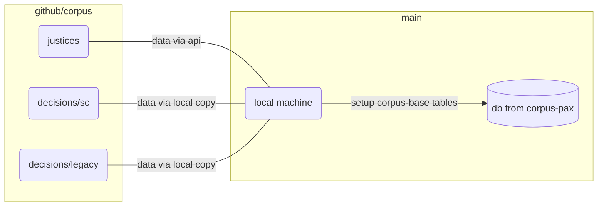

# Corpus-Base



With the database used in [corpus-pax](https://github.com/justmars/corpus-pax), create additional tables related to decisions of the Philippine Supreme Court.

```python shell
>>> from corpus_base import build_sc_tables
>>> build_sc_tables(c)
```

This creates additional tables associated with:

1. Justices
2. Decisions
   - Citations
   - Votelines
   - Titletags
   - Opinions

```python shell
>>> from corpus_base import init_sc_cases
>>> init_sc_cases(c, test_only=10)
```

Parse through a locally downloaded repository to populate tables. Since there are thousands of cases, can limit the number of downloads via the `test_only` function attribute. The path location of the downloaded repository is [hard-coded](./corpus_base/utils/resources.py) since this package is intended to be run locally. Instructions for downloading and updating the repository are discussed elsewhere.

## Build from scratch

```python shell
>>> from corpus_base import setup_base_db
>>> setup_base_db('x.db') # creates the database in present working directory
```

## Limited to 3.11.0

See [citation-report](https://github.com/justmars/citation-report) on reason why Python version is limited to `3.11.0` in both:

1. [pyproject.toml](pyproject.toml); and
2. [github workflow](.github/workflows/main.yml)

## Related features

### Insert records

Can add all pydantic validated records from the local copy of justices to the database.

```python shell
>>> from corpus_base import Justice
>>> Justice.init_justices_tbl(c) # c = instantiated Connection
<Table justices_tbl (first_name, last_name, suffix, full_name, gender, id, alias, start_term, end_term, chief_date, birth_date, retire_date, inactive_date)>
```

### Clean raw ponente string

Each `ponente` name stored in `decisions_tbl` of the database has been made uniform, e.g.:

```python shell
>>> from corpus_base import RawPonente
>>> RawPonente.clean("REYES , J.B.L, Acting C.J.") # sample name 1
"reyes, j.b.l."
>>> RawPonente.clean("REYES, J, B. L. J.") # sample name 2
"reyes, j.b.l."
```

We can see  most common names in the `ponente` field and the covered dates, e.g. from 1954 to 1972 (dates found in the decisions), there have been 1053 decisions marked with `jbl` (as cleaned):

```python shell
>>> from corpus_base.helpers import most_popular
>>> [i for i in most_popular(c, db)] # excluding per curiams and unidentified cases
[
    ('1994-07-04', '2017-08-09', 'mendoza', 1297), # note multiple personalities named mendoza, hence long range from 1994-2017
    ('1921-10-22', '1992-07-03', 'paras', 1287), # note multiple personalities named paras, hence long range from 1921-1992
    ('2009-03-17', '2021-03-24', 'peralta', 1243),
    ('1998-06-18', '2009-10-30', 'quisumbing', 1187),
    ('1999-06-28', '2011-06-02', 'ynares-santiago', 1184),
    ('1956-04-28', '2008-04-04', 'panganiban', 1102),
    ('1936-11-19', '2009-11-05', 'concepcion', 1058), # note multiple personalities named concepcion, hence long range from 1936-2009
    ('1954-07-30', '1972-08-18', 'reyes, j.b.l.', 1053),
    ('1903-11-21', '1932-03-31', 'johnson', 1043),
    ('1950-11-16', '1999-05-23', 'bautista angelo', 1028), # this looks like bad data
    ('2001-11-20', '2019-10-15', 'carpio', 1011),
    ...
]
```

### Isolate active justices on date

When selecting a ponente or voting members, create a candidate list of justices based on date:

```python shell
>>> from corpus_base import Justice
>>> Justice.get_active_on_date(c, 'Dec. 1, 1995') # target date
[
    {
        'id': 137,
        'surname': 'panganiban',
        'alias': None,
        'start_term': '1995-10-05', # since start date is greater than target date, record is included
        'inactive_date': '2006-12-06',
        'chief_date': '2005-12-20'
    },
    {
        'id': 136,
        'surname': 'hermosisima',
        'alias': 'hermosisima jr.',
        'start_term': '1995-01-10',
        'inactive_date': '1997-10-18',
        'chief_date': None
    },
]
```

## Designation as chief or associate

Since we already have candidates, we can cleaning desired option to get the `id` and `designation`:

```python shell
>>> from corpus_base import RawPonente
>>> RawPonente.clean('Panganiban, Acting Cj')
'panganiban'
>>> Justice.get_justice_on_date(c, '2005-09-08', 'panganiban')
{
    'id': 137,
    'surname': 'Panganiban',
    'start_term': '1995-10-05',
    'inactive_date': '2006-12-06',
    'chief_date': '2005-12-20',
    'designation': 'J.' # note variance
}
```

Note that the raw information above contains 'Acting Cj' and thus the designation is only 'J.'

At present we only track 'C.J.' and 'J.' titles.

With a different date, we can get the 'C.J.' designation.:

```python shell
>>> Justice.get_justice_on_date('2006-03-30', 'panganiban')
{
    'id': 137,
    'surname': 'Panganiban',
    'start_term': '1995-10-05',
    'inactive_date': '2006-12-06',
    'chief_date': '2005-12-20',
    'designation': 'C.J.' # corrected
}
```

## View chief justice dates

```python shell
>>> from corpus_base import Justice
>>> Justice.view_chiefs(c)
[
    {
        'id': 178,
        'last_name': 'Gesmundo',
        'chief_date': '2021-04-05',
        'max_end_chief_date': None,
        'actual_inactive_as_chief': None,
        'years_as_chief': None
    },
    {
        'id': 162,
        'last_name': 'Peralta',
        'chief_date': '2019-10-23',
        'max_end_chief_date': '2021-04-04',
        'actual_inactive_as_chief': '2021-03-27',
        'years_as_chief': 2
    },
    {
        'id': 163,
        'last_name': 'Bersamin',
        'chief_date': '2018-11-26',
        'max_end_chief_date': '2019-10-22',
        'actual_inactive_as_chief': '2019-10-18',
        'years_as_chief': 1
    },
    {
        'id': 160,
        'last_name': 'Leonardo-De Castro',
        'chief_date': '2018-08-28',
        'max_end_chief_date': '2018-11-25',
        'actual_inactive_as_chief': '2018-10-08',
        'years_as_chief': 0
    }...
]
```
