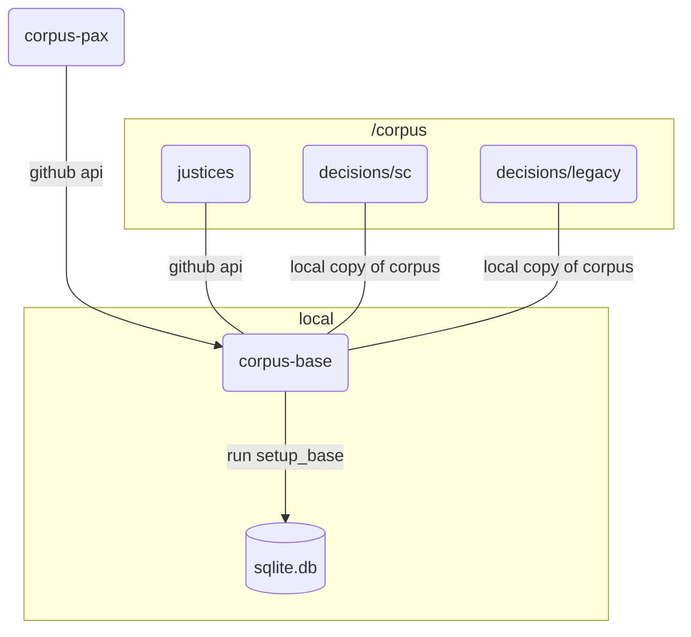

---
hide:
- navigation
- toc
---
# Corpus Base Docs



## Concept

In tandem with [corpus-pax](https://github.com/justmars/corpus-pax), `corpus-base` creates [sqlpyd](https://github.com/justmars/sqlpyd) tables related to decisions of the Philippine Supreme Court, thereby adding the following:

1. Justices
2. Decisions
   - Citations
   - Votelines
   - Titletags
   - Opinions
   - Segments

## Repositories

To review the different repositories involved so far:

repository | type | purpose
:--|:--:|:--
[lawsql-articles](https://github.com/justmars/lawsql-articles) | data source | used by _corpus-pax_
[corpus-entities](https://github.com/justmars/corpus-entities) | data source | used by _corpus-pax_
[corpus](https://github.com/justmars/corpus) | data source | used by _corpus-base_
[corpus-pax](https://github.com/justmars/corpus-pax) | sqlite i/o | functions to create pax-related tables
_corpus-base_ | sqlite i/o | functions to create sc-related tables

## Run

```py
>>> from corpus_pax import setup_pax_base
>>> db_name =  # assume target db to be created/recreated is in the present working directory
>>> setup_pax_base('test.db') # takes ~20 to 30 minutes to create/recreate in working dir
```

## Caveats

### Flow

1. Unlike `corpus-pax` which operates over API calls, `corpus-base` operates locally.
2. It implies parsing through a locally downloaded repository `corpus` to populate tables.
3. _Opinions_ are limited. Save for 1 or 2 sample situations, the present `corpus` only includes the Ponencia.

### Data

The path location of the downloaded `corpus` repository is hard-coded since this package is intended to be run locally.

Instructions for downloading and updating the repository are discussed elsewhere.

Now toying with the idea of placing the entire `corpus` in a bucket like AWS S3 or Cloudflare R2. So that all access can be cloud-based.
