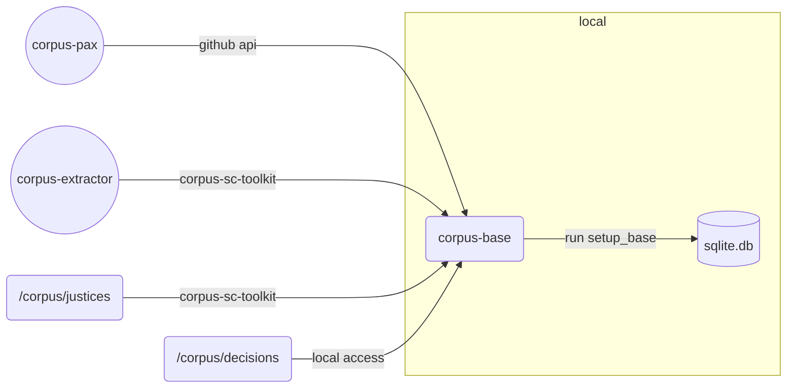

# Overview



## Concept

See [corpus-pax](https://github.com/justmars/corpus-pax): this establishes the database tables related
to individuals and organizations.

After the creation of the personnel, we can proceed to `corpus-base`. This creates [sqlpyd](https://github.com/justmars/sqlpyd)-tables related to _decisions_ of the Philippine Supreme Court, incorporating the following models:

- Decisions
- Justices
- Citations
- Votelines
- Titletags
- Opinions
- Segments

[corpus-sc-toolkit](https://github.com/justmars/corpus-sc-toolkit) helps process individual components described above and includes
the functions required to:

1. deal with justice identity; and
2. extract metadata of pdf-based documents processed via [corpus-extractor](https://github.com/justmars/corpus-extractor).

## Run

```py
>>> from corpus_pax import setup_pax_base
>>> db_name =  # assume target db to be created/recreated is in the present working directory
>>> setup_pax_base('test.db') # takes ~20 to 30 minutes to create/recreate in working dir
```

## Caveats

### Flow

1. Unlike `corpus-pax` which operates over API calls, `corpus-base` operates locally.
2. It implies parsing through a locally downloaded repository `corpus` to populate tables.
3. _Opinions_ are limited. Save for 1 or 2 sample situations, the present `corpus` only includes the Ponencia.

### Data

The path location of the downloaded `corpus` repository is hard-coded since this package is intended to be run locally.

Instructions for downloading and updating the repository are discussed elsewhere.

Now toying with the idea of placing the entire `corpus` in a bucket like AWS S3 or Cloudflare R2. So that all access can be cloud-based.

## Prerequisites

### Repositories

Different repositories involved:

repository | status | type | purpose
:--|:--:|:--:|:--
[lawsql-articles](https://github.com/justmars/lawsql-articles) | private | data source | used by _corpus-pax_; yaml-formatted member and org files
[corpus-entities](https://github.com/justmars/corpus-entities) | private | data source | used by _corpus-pax_; markdown-styled articles with frontmatter
[corpus](https://github.com/justmars/corpus) | private | data source | used by _corpus-base_
[corpus-sc-toolkit](https://github.com/justmars/corpus-sc-toolkit) | public | functions to create sc-related tables | used by _corpus-base_
[corpus-pax](https://github.com/justmars/corpus-pax) | public | sqlite i/o | functions to create pax-related tables
[corpus-base](https://github.com/justmars/corpus-base)| public | sqlite i/o |  functions to create sc-related tables

### .env

Create an .env file to create/populate the database. See `sample .env` highlighting the following variables:

1. Cloudflare `CF_ACCT`
2. Cloudflare `CF_TOKEN`
3. Github `GH_TOKEN`
4. `DB_FILE` (sqlite)

Note the workflow (main.yml) where the secrets are included for Github actions. Ensure these are set in the repository's `<url-to-repo>/settings/secrets/actions`, making the proper replacements when the tokens for Cloudflare and Github expire.

## Helper function to do things incrementally

```py
>>> from corpus_base import init_sc_cases
>>> init_sc_cases(c, test_only=10)
```

Since there are thousands of cases, can limit the number of downloads via the `test_only` function attribute.
